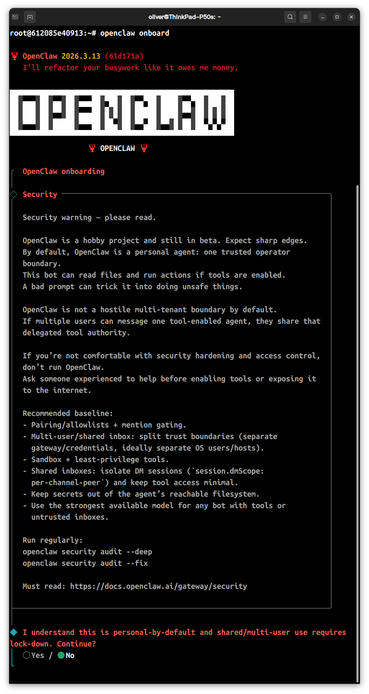

# Start openclaw
利用docker快速启动您的openclaw
语言/language:[English](README.md)
## 快速入门
在此之前，请做好以下准备
- 宿主机已安装`docker`
- 宿主机可以访问`ghcr.io`
- 宿主机可以访问`github.com`
### 1.拉取镜像
您可以通过以下命令拉取镜像
```bash
sudo docker pull ghcr.io/iamliuxiaozhen/start-openclaw:latest
```
### 2.运行
构建运行有2个方法，请根据您的需要进行参考
- 方法1 `docker-compose`(推荐)
- 方法2 `docker run`命令
#### 使用`docker-compose`运行此项目
参考本项目的`docker-compose.yml.example`文件。下载本文件后将本文件重命名为`docker-compose`
```yaml
services:
  openclaw:
    build: .
    container_name: openclaw-bot
    restart: unless-stopped
    privileged: true
    ports:
      - "127.0.0.1:18789:18789"
    volumes:
     # 这里填挂载卷
     # -/home/usermae/ai-workspace:/workspace
     # /home/username/.openclaw:/root/.openclaw
    environment:
      - NODE_ENV=production

    stdin_open: true
    tty: true
```
通常，您只需要修改挂载卷
> [!CAUTION]
>强烈建议您配置挂载卷，否则AI容易丢失上下文甚至重要资料。
##### 使用`docker run`命令
您可以运行以下命令启动本项目
```bash
docker run -d \
  --name openclaw-bot \
  --restart unless-stopped \
  --privileged \
  -p 127.0.0.1:18789:18789 \
  -v /home/username/ai-workspace:/workspace \
  -v /home/username/.openclaw:/root/.openclaw \
  -e NODE_ENV=production \
  -it \
  openclaw:latest
```
请将`-v`的参数换为您想将挂载卷存放的位置。
> [!CAUTION]
>强烈建议您配置挂载卷，否则AI容易丢失上下文甚至重要资料。
### 初始化openclaw（首次需要）
要初始openclaw，您需要先进入容器内部，请使用下列命令进入docker容器内部
```bash
docker exec -it openclaw-bot bash
```
接着，初始化openclaw
```bash
openclaw onboard
```


阅读并知晓风险
``bash
◆  Onboarding mode
│  ● QuickStart (Configure details later via openclaw configure.)
│  ○ Manual
```
选择`QuickStart`继续
```bash
◆  Model/auth provider
│  ● OpenAI (Codex OAuth + API key)
│  ○ Anthropic
│  ○ Chutes
│  ○ MiniMax
│  ○ Moonshot AI (Kimi K2.5)
│  ○ Google
│  ○ xAI (Grok)
│  ○ Mistral AI
│  ○ Volcano Engine
│  ○ BytePlus
│  ○ OpenRouter
│  ○ Kilo Gateway
│  ○ Qwen
│  ○ Z.AI
│  ○ Qianfan
│  ○ Alibaba Cloud Model Studio
│  ○ Copilot
│  ○ Vercel AI Gateway
│  ○ OpenCode
│  ○ Xiaomi
│  ○ Synthetic
│  ○ Together AI
│  ○ Hugging Face
│  ○ Venice AI
│  ○ LiteLLM
│  ○ Cloudflare AI Gateway
│  ○ Custom Provider
│  ○ Ollama
│  ○ SGLang
│  ○ vLLM
│  ○ Skip for now
└
```
选择适合您的大模型提供商
```bash
◇  Model configured ─────────────────────────────╮
│                                                │
│  Default model set to qwen-portal/coder-model  │
│                                                │
├────────────────────────────────────────────────╯
│
◆  Default model
│  ● Keep current (qwen-portal/coder-model)
│  ○ Enter model manually
│  ○ qwen-portal/coder-model
│  ○ qwen-portal/vision-model
└
```
选择使用的模型
```bash
◆  Select channel (QuickStart)
│  ● Telegram (Bot API) (recommended · newcomer-friendly)
│  ○ WhatsApp (QR link)
│  ○ Discord (Bot API)
│  ○ IRC (Server + Nick)
│  ○ Google Chat (Chat API)
│  ○ Slack (Socket Mode)
│  ○ Signal (signal-cli)
│  ○ iMessage (imsg)
│  ○ LINE (Messaging API)
│  ○ Feishu/Lark (飞书)
│  ○ Nostr (NIP-04 DMs)
│  ○ Microsoft Teams (Bot Framework)
│  ○ Mattermost (plugin)
│  ○ Nextcloud Talk (self-hosted)
│  ○ Matrix (plugin)
│  ○ BlueBubbles (macOS app)
│  ○ Zalo (Bot API)
│  ○ Zalo (Personal Account)
│  ○ Synology Chat (Webhook)
│  ○ Tlon (Urbit)
│  ○ Skip for now
└
```
这里让我们配置聊天软件，如果没有选择`Skip for now`
```bash
◇  Web search ────────────────────────────────────────╮
│                                                     │
│  Web search lets your agent look things up online.  │
│  Choose a provider and paste your API key.          │
│  Docs: https://docs.openclaw.ai/tools/web           │
│                                                     │
├─────────────────────────────────────────────────────╯
│
◆  Search provider
│  ● Brave Search (Structured results · country/language/time filters)
│  ○ Gemini (Google Search)
│  ○ Grok (xAI)
│  ○ Kimi (Moonshot)
│  ○ Perplexity Search
│  ○ Skip for now
```
这里让我们配置网络搜索功能，如果没有选择`Skip for now`
根据提示继续操作即可

这里省去一些步骤，后续补上。
### 访问openclaw
配置完成后，您可以通过：
```url
http://127.0.0.1:18789/
```
访问openclaw的网页版
## 进阶与其他
### 修复宿主机无法访问`http://127.0.0.1:18789/`
进入容器
```bash
docker exec -it openclaw-bot bash
```
进入目录
```bash
cd /root/.openclaw
```
修改配置
```bash
nano openclaw.json
```
找到`"bind": "loopback"`
修改为`"bind": "lan"`
|模式|监听范围|
|--|--|
|loopback|只容器内部
|lan|局域网
|auto|自动判断
|tailnet|只在 Tailscale
|custom|自定义

### 配置全局域网访问openclaw网页版

上述的docker启动文件从`127.0.0.1`改为`0.0.0`
通过`docker-compose.yml`
```yaml
ports:
    - "0.0.0.0:18789:18789"
```
通过`docker run`
```dash
-p 0.0.0.0:18789:18789 \
```

> [!CAUTION]
> 这一步存在风险，若您宿主机防火墙配置不当，甚至可能导致公网访问，我更推荐有条件使用Nginx反向代理
